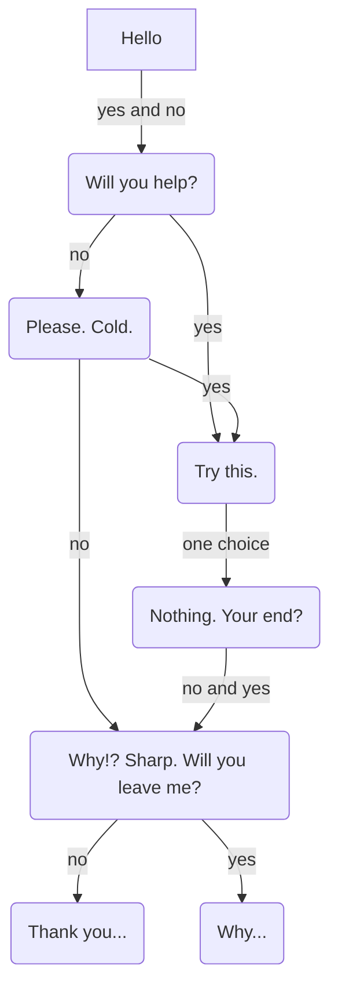

# Ghost In The Machine
#### **Video Demo:** <TODO: URL>
#### **Description:**
Ghost In The Machine is a command line paranormal horror story game. The user will interact with an unknown entity (the ghost) via the command line.
It was inspired by my love of the spooky. The tone and expierence of the ghost was inspired by the podcast "The Magnus Archives" #65: Bianry by [Rusty Quill](https://rustyquill.com/show/the-magnus-archives/).

As you answer the ghost's questions you learn more about their expierence and even see some of their inner thoughts represented through ascii text.

This game is written Go using [promptui](https://github.com/manifoldco/promptui), [go-figure](https://github.com/common-nighthawk/go-figure), and [cobra](https://github.com/spf13/cobra).
My profound thanks to these creators, who made it possible.

If you would like to play this very short game:
1. [clone](https://docs.github.com/en/repositories/creating-and-managing-repositories/cloning-a-repository) this repository
2. run `go build` in your terminal


Inside `gtim` you will find `cmd`.
The `cmd` folder contains `root.go` which is the game _Ghost In The Machine_. The user responds via yes and no questions to the ghost without ever leaving the program. I entertained the idea of using cobra to create custom commands that had the user stoping and starting diffrent programs. In the end I decided the more linear expierence of remaing in a single program was better for the story.

## This function controls the speed of the ghost's messages to the user
```go
// dialogue renders ghost script of any length with pauses
func dialogue(script []string, pause time.Duration) error {
	if len(script) == 0 {
		return fmt.Errorf("Must provide string")
	}
	if pause < 0 {
		return fmt.Errorf("Pause must be of duration 0 or greater")
	}
	for _, line := range script {
		time.Sleep(pause * time.Second)
		fmt.Println(line)
		time.Sleep(pause * time.Second)
	}
	return nil
}
```
I found without pause in message speed the ghost felt empty and flat.

## Story Flow (spoilers!)



### Creator's Note
The situation wherein the user will probally force quit the program is a stylistic choice, not an error in programing.
