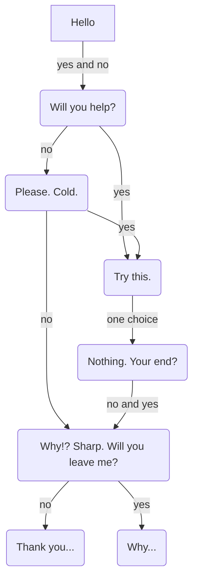

# Ghost In The Machine
#### **Video Demo:** <TODO: URL>
#### **Discription:**
Ghost In The Machine is a command line paranormal horror story/ game. The user will interact with an unknown entity via the command line.
It was inspired by my love of the spooky. The largest insperation for this project was the podcast "The Magnus Archives" by [Rusty Quill](https://rustyquill.com/show/the-magnus-archives/).

It is written Go using promptui, go-figure, and cobra.

If you would like to download this very short game ...

## Examples to use later
```go
// dialogue renders ghost script of any length with pauses
func dialogue(script []string, pause time.Duration) error {
	if len(script) == 0 {
		return fmt.Errorf("Must provide string")
	}
	if pause < 0 {
		return fmt.Errorf("Pause must be of duration 0 or greater")
	}
	for _, line := range script {
		time.Sleep(pause * time.Second)
		fmt.Println(line)
		time.Sleep(pause * time.Second)
	}
	return nil
}
```

## Story Flow (spoilers!)



### Creator's Note
The situation wherein the user will probally force quit the program is a styleistic choice, not an error in programing.
