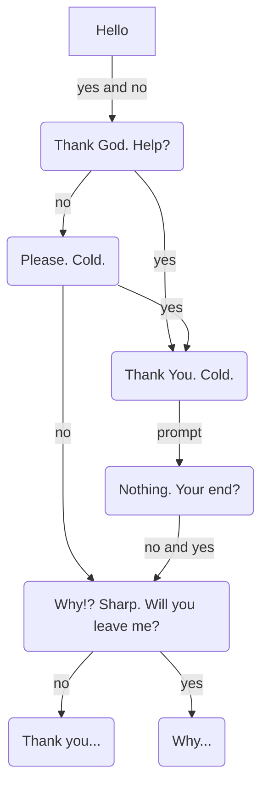

# Ghost In The Machine
#### **Video Demo:** <TODO: URL>
#### **Discription:**
Ghost In The Machine is a command line paranormal horror story/ game. The user will interact with an unknown entity via the command line.
It was inspired by my love of the spooky. The largest insperation for this project was the podcast "The Magnus Archives" by Rusty Quill.

It is written using golang and cobra_cli.
These are the instructions for downloading it. ...

## Examples to use later
```python
for thing in things:
  print(thing)
```

## Story Flow (spoilers!)



### Creator's Note
The situation wherein the user must force quit the program is a styleistic choice, not an error in programing.
